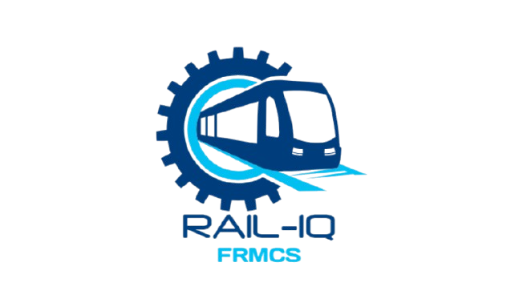
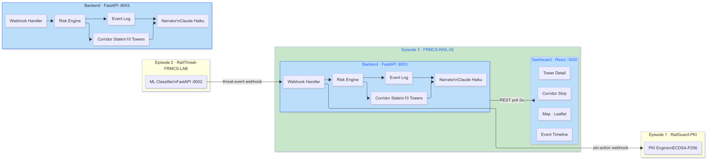
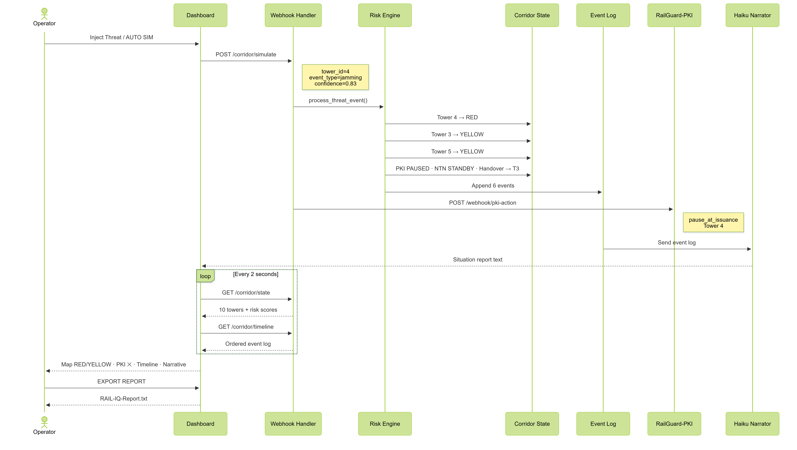
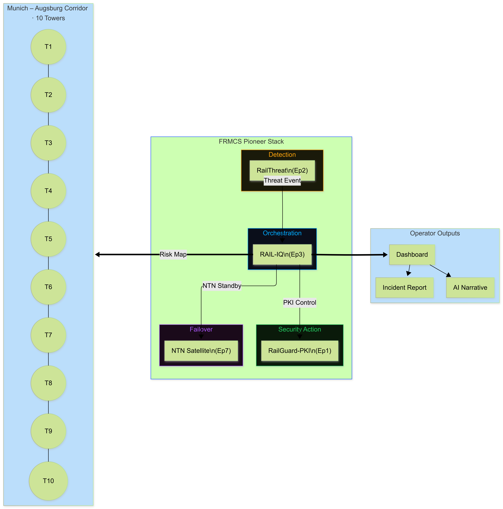

# FRMCS-RAIL-IQ

[](https://github.com/shariquetelco/FRMCS-RAIL-IQ)
[](https://python.org)
[](https://fastapi.tiangolo.com)
[](https://react.dev)
[](https://uic.org)
[](https://vtc2026.ieee-vts.org)

**Episode 3 of the FRMCS Pioneer Stack**  
Network Risk & Response Orchestration — Munich–Augsburg Corridor

**Author:** Ahmad Sharique  · IABG mbH  
**Status:** Active Development  
**Target:** IEEE VTC 2026

---



---

## What This Is

FRMCS-RAIL-IQ is the orchestration brain of the FRMCS Pioneer Stack. It sits between the threat detection layer (RailThreat, Episode 2) and the identity action layer (RailGuard-PKI, Episode 1).

When RailThreat flags a compromised tower, RAIL-IQ answers the operational question no other episode answers:

> *What does one compromised tower mean for the entire 60km corridor?*

It maintains a real-time risk map across all 10 Munich–Augsburg towers, models threat propagation to adjacent cells, and fires deterministic response actions — PKI pause, handover preparation, NTN standby — within milliseconds.

---

## The FRMCS Pioneer Stack

| Episode | Project | Key Tech | Status |
|---------|---------|----------|--------|
| 1 | RailGuard-PKI | ECDSA-P256, ETSI TS 102941, Flask | ✅ Done |
| 2 | RailThreat-FRMCS-LAB | FastAPI, 11-feature ML classifier, Prometheus | ✅ Done |
| 3 | **FRMCS-RAIL-IQ** | FastAPI, Risk Engine, React, Claude Haiku | ✅ Done |
| 4 | FRMCS-RF-Corridor | OAI, Open5GS, GNU Radio, NVIDIA Sionna | 📋 Planned |
| 5 | FRMCS-eBPF-Shield | eBPF/XDP, bcc, libbpf | 📋 Planned |
| 6 | PQC-RailGuard | ML-KEM (Kyber), ML-DSA (Dilithium) | 📋 Planned |
| 7 | FRMCS-NTN-Failover | OAI NTN n254, GEO/LEO simulators | 🟡 Partial |

---

## System Architecture



### Layer Model

| Layer | Component | Role |
|-------|-----------|------|
| 🟡 Detection | RailThreat (Ep. 2) | RF threat classification |
| 🔵 Orchestration | FRMCS-RAIL-IQ (Ep. 3) | Corridor risk & response | 🟢 Action | RailGuard-PKI (Ep. 1) | PKI identity management |
| 🟣 Failover | NTN Satellite (Ep. 7) | Satellite backup |

### Data Flow
```
RailThreat → ① threat-event webhook → RAIL-IQ Risk Engine
RAIL-IQ    → ② pki-action webhook   → RailGuard-PKI
RAIL-IQ    → ③ ntn-standby command  → NTN Layer
RAIL-IQ    → ④ risk scores          → 10 Corridor Towers
RAIL-IQ    → ⑤ live state (2s poll) → React Dashboard
```

---

## Call Flow



### Event Sequence — Jamming on Tower 4
```
14:32:07  RailThreat fires webhook → tower_id=4, jamming, confidence=0.83
14:32:07  Risk Engine: Tower 4 → RED, risk_score=0.83
14:32:07  Adjacency propagation: Tower 3 → YELLOW (0.332), Tower 5 → YELLOW (0.332)
14:32:07  Response rules: confidence 0.83 ≥ threshold 0.70
14:32:07  PKI AT issuance PAUSED on Tower 4
14:32:07  Handover prepared → Tower 3 (Lochhausen)
14:32:07  NTN failover on STANDBY
14:32:08  RailGuard-PKI webhook fired: pause_at_issuance
14:32:08  Event log: 6 entries appended
14:32:08  Claude Haiku: situation report generated
14:32:09  Dashboard: map updated, timeline populated
```

---

## Dashboard



### Four Zones

| Zone | Component | Description |
|------|-----------|-------------|
| Top strip | CorridorStrip | 10 tower icons, Munich → Augsburg, GREEN/YELLOW/RED |
| Center | CorridorMap | Leaflet dark map, threat radius rings, GPS coordinates |
| Right panel | TowerDetail | Risk metrics, threat injection, response actions |
| Bottom | EventTimeline | Scrollable audit trail, color-coded by action type |

---

## Risk Scoring Model
```
Tower risk score = own_threat_confidence
                + (0.4 × left_neighbor_score)
                + (0.4 × right_neighbor_score)

Thresholds:
  score ≥ 0.60  →  RED    (critical)
  score ≥ 0.30  →  YELLOW (elevated)
  score < 0.30  →  GREEN  (nominal)

Response rules (deterministic):
  confidence ≥ 0.70 AND event ∈ {jamming, spoofing, replay}
    → PKI AT issuance PAUSED
    → Handover prepared to lowest-risk neighbor
    → NTN failover on STANDBY
```

---

## Munich–Augsburg Corridor — 10 Towers

| ID | Name | Lat | Lon |
|----|------|-----|-----|
| T1 | München Hbf | 48.1402 | 11.5580 |
| T2 | Pasing | 48.1497 | 11.4613 |
| T3 | Lochhausen | 48.1681 | 11.3672 |
| T4 | Dachau | 48.2597 | 11.4342 |
| T5 | Schwabhausen | 48.2991 | 11.3100 |
| T6 | Althegnenberg | 48.2750 | 11.1200 |
| T7 | Moorenweis | 48.2553 | 11.0100 |
| T8 | Geltendorf | 48.0397 | 10.9836 |
| T9 | Kaufering | 48.0833 | 10.8700 |
| T10 | Augsburg Hbf | 48.3654 | 10.8855 |

---

## Project Structure
```
FRMCS-RAIL-IQ/
│
├── backend/
│   ├── corridor.py       ← 10-tower corridor model + adjacency map
│   ├── risk_engine.py    ← threat propagation + deterministic response rules
│   ├── event_log.py      ← in-memory audit trail
│   ├── main.py           ← FastAPI app, REST endpoints, CORS
│   └── narrator.py       ← Claude Haiku situation reports (planned)
│
├── dashboard/
│   └── src/
│       ├── App.js
│       └── components/
│           ├── CorridorStrip.jsx
│           ├── CorridorMap.jsx
│           ├── TowerDetail.jsx
│           └── EventTimeline.jsx
│
├── diagrams/
│   ├── logo.png
│   ├── System_Arch.png
│   ├── Call_FLow.png
│   └── Dashboard_Arch.png
│
└── README.md
```

---

## API Endpoints

| Method | Endpoint | Description |
|--------|----------|-------------|
| GET | `/` | Project info |
| GET | `/health` | Server health + log count |
| GET | `/corridor/state` | All 10 towers, risk scores, statuses |
| GET | `/corridor/timeline` | Event log, newest first |
| POST | `/corridor/simulate` | Inject synthetic threat event |
| POST | `/corridor/reset` | Reset corridor to GREEN |

### Simulate Request
```json
{
  "tower_id": 4,
  "event_type": "jamming",
  "confidence": 0.83
}
```

---

## Running Locally

**Terminal 1 — Backend**
```bash
cd backend
.\Rail-IQ\Scripts\Activate.ps1
uvicorn main:app --reload --port 8003
```

**Terminal 2 — Dashboard**
```bash
cd dashboard
npm start
```

**Browser**
```
http://localhost:3000
```

---

## Demo Flow

1. Open `http://localhost:3000`
2. Click **AUTO SIM** — 6 attack scenarios fire across the corridor
3. Watch towers flip RED/YELLOW, PKI pause, handover prepare
4. Click any tower for detail and threat injection
5. Click **EXPORT REPORT** — downloads full incident report
6. Click **RESET CORRIDOR** — corridor returns to GREEN

---

## Key Design Decisions

**Deterministic response rules, not ML decisions.**  
Certificate pausing, handover preparation, and NTN standby are rule-based with clear confidence thresholds. The LLM (Claude Haiku) is used only for natural language narration, never for security decisions.

**In-memory state, no database.**  
Keeps the demo lightweight and the architecture explainable. Production upgrade path is Redis or Kafka.

**Adjacency-weighted risk propagation.**  
A tower that is clean but flanked by two compromised neighbors still gets elevated to YELLOW. This matches how real railway corridor planners think — in segments, not isolated cells.

---

## Academic Context

This project is part of ongoing research targeting **IEEE VTC 2026**.  
It demonstrates a full cross-layer FRMCS security architecture:
```
RF attack → ML detection → corridor orchestration → PKI action
```

No existing FRMCS demo shows all four layers connected in a single working system.

---

## License

Research and demonstration purposes.  
© 2026 Ahmad Sharique · IABG mbH · All rights reserved.

IPR notice: consult IABG IP department before external publication.